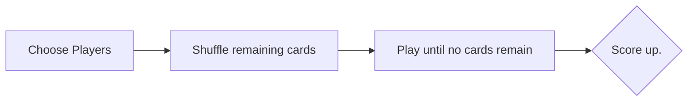
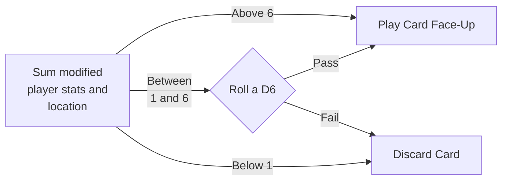
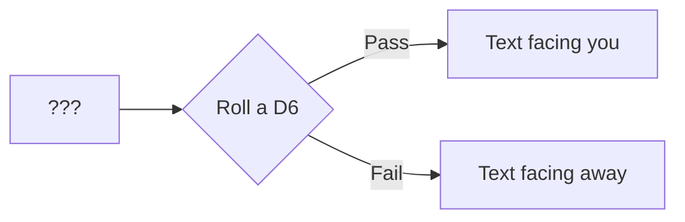

### Overview of gameplay

[View](https://mermaidjs.github.io/mermaid-live-editor/#/edit/eyJjb2RlIjoiZ3JhcGggTFJcbiAgQVtDaG9vc2UgUGxheWVyc10gLS0-IEI7XG4gIEJbU2h1ZmZsZSByZW1haW5pbmcgY2FyZHNdIC0tPiBDO1xuICBDW1BsYXkgdW50aWwgbm8gY2FyZHMgcmVtYWluXSAtLT4gRDtcbiAgRHtTY29yZSB1cC59OyIsIm1lcm1haWQiOnsidGhlbWUiOiJkZWZhdWx0In19)

# Playing Cards
Uhhh. You do?

#### Location Card
First, choose the location to play and pick an Event/Character/Artifact to encounter.

[View](https://mermaidjs.github.io/mermaid-live-editor/#/edit/eyJjb2RlIjoiZ3JhcGggTFJcbiAgQVtTdW0gbW9kaWZpZWQ8YnIvPiBwbGF5ZXIgc3RhdHMgYW5kPGJyLz4gbG9jYXRpb25dO1xuICBBIC0tQWJvdmUgNi0tPiBEb25lO1xuICBBIC0tQmV0d2Vlbjxici8-IDEgYW5kIDYtLT4gUm9sbDtcbiAgQSAtLUJlbG93IDEtLT4gRmFpbDtcbiAgUm9sbHtSb2xsIGEgRDZ9O1xuICBSb2xsIC0tUGFzcy0tPiBEb25lO1xuICBSb2xsIC0tRmFpbC0tPiBGYWlsXG5cbiAgRG9uZVtQbGF5IENhcmQgRmFjZS1VcF07XG4gIEZhaWxbRGlzY2FyZCBDYXJkXTsiLCJtZXJtYWlkIjp7InRoZW1lIjoiZGVmYXVsdCJ9fQ)

### Event Card
Events have a requirement that must be met in order to resolve.

In addition to the Event card, you must be able to play cards of the type named on the Event.

### Character Card
2 chances? 1 against ego and 1 against order? Or pick?
Combine and roll? Undecided.

You pursuade them and either gain their favor (text facing you) or fail (upside down, text facing away). Either way, they stack next to player.

### Artifact Card
No conditions. If you play it, it happens.

Place next to player and align stats.

Artifact stats modify player stats

### Scoring
Play until nothing left to draw.

Score points on each card.

Score associated with player:
* Events: +2 -> +8, depending on event
* Rightside up characters: +1, upside down -1
* Artifacts have + or -